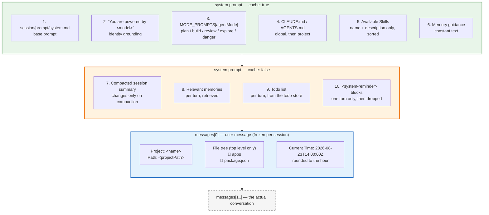

# Context engine

The model begins every request knowing nothing. Not the project name, not what
language it is in, not that you asked it something five minutes ago. Everything
it knows was put there by this subsystem, and everything put there is re-sent on
every subsequent request until the conversation is compacted.

That second half is what makes context engineering a discipline rather than a
formatting exercise. A section added "just in case" is not paid once — it is
paid per turn, for the life of the session. And a section that *changes* between
turns is worse than a large one: it moves the bytes of the cached prefix and
re-bills everything after it.

So the engine has exactly two rules:

1. **Say only what can't be discovered.** Anything the model can fetch with a
   tool should be fetched with a tool.
2. **Once said, don't move it.** Stable content goes early, volatile content
   goes late.

## What actually reaches the model



Blocks 1–6 are assembled by `PromptCompiler.compileSystemBlocks`
(`context/compiler.ts:137`) into **one** block marked `cache: true`. Blocks 7–10
are assembled by the loop and appended as separate `cache: false` blocks, so
rewriting them every turn costs nothing — they sit *after* the breakpoint.

The project summary is not a system block at all. It is inlined as the
conversation's first **user** message, with a fixed id and `timestamp: 0`.
Claude Code splits at the same boundary (`SYSTEM_PROMPT_DYNAMIC_BOUNDARY`) for
the same reason: the static half must stay a stable cacheable prefix, and
anything that moves has to live below it.

## The static half

### The base prompt

`session/prompt/system.md` — ~100 lines, provider-agnostic, covering Identity,
Autonomy and persistence, Communication style, Planning with `todowrite`, Think
before coding, Simplicity and surgical changes, Goal-driven execution, Tools,
and Scope.

Loading it has to satisfy two runtimes (`session/prompt.ts`). Under `tsx` the
file sits on disk next to the module and is read directly, so edits are picked
up without a rebuild. Inside the `bun --compile` binary nothing is on disk, so
the same file is pulled in through a static text import that bun bakes into the
executable.

If both fail, the fallback is a **single sentence** — no tool guidance, no
standards, no mode behaviour. That degrades quality invisibly rather than
failing, which is exactly how it went unnoticed until a session showed the model
ignoring instructions that were never sent. It now logs a warning naming the
likely cause (a stale `dist`).

### Model identity

`You are powered by the model named <model>.` One line, and it exists so the
model doesn't introduce itself as the product whose training data it most
resembles.

### Mode

Five preambles in `MODE_PROMPTS` (`compiler.ts:18`) — plan, build, review,
explore, danger. These are *instructions*, not enforcement: plan mode is
actually held read-only by [the permission engine](/internals/permissions),
which hard-denies mutating tools before any rule is consulted. The preamble
exists so the model understands the situation rather than discovering it through
denials.

### Project instructions

`compileInstructionsSection` (`context/instructions.ts:36`) reads two
directories, in prompt order:

1. Global — `~/.freecode/`
2. Project root — the project directory

Within each, `CLAUDE.md` wins over `AGENTS.md`, and only the **first non-empty
match** is used — they don't merge. Each is rendered with its own header:

```
Instructions from: /home/you/project/CLAUDE.md
<contents>
```

The joined section is capped at 40,000 characters. Note the cap applies *after*
joining, and global comes first, so an oversized global file can crowd the
project's own instructions out of the prompt entirely.

There is no walk-up for monorepos, no `@imports`, and no glob-scoped rules —
all deliberately deferred, and tracked in `TODO.md`.

### Skills and memory guidance

Skills are advertised as **name and description only**
(`skills/prompt.ts:16`) — the full body is loaded on demand through the `skill`
tool. The list is sorted so an identical skill set produces identical bytes.

The memory block here is the constant *how to use memory* guidance
(`memory/mem-prompt.ts:104`). The memories themselves are injected per turn,
below the breakpoint, by the loop — see [Memory](/internals/memory).

## The dynamic half

```ts
compileDynamicContext(tree, gitHead, ignorePatterns, memoryContext?, clock?)
```

Three parameters carry their own history:

- **`ignorePatterns`** is always `""` from the loop. It survives as a cache-key
  component.
- **`memoryContext`** is always `undefined`, deliberately. The comment above the
  call site is a warning: rendering `recentMessages` here rewrote position 0 on
  every request and invalidated the whole conversation prefix — and it was
  redundant, because those same messages are already in the history immediately
  below.
- **`clock`** is rounded to the hour and frozen with the tree, so position 0
  doesn't rewrite itself when the clock ticks over.

### The tree is one level deep

`computeProjectContext` (`context/tree-cache.ts:26`) does a single
non-recursive `readdirSync` of the project root and renders it with emoji:

```
  📁 apps
  📁 packages
  📄 package.json
  📄 README.md
```

That's the whole "file tree". It is a deliberate floor, not an oversight — the
model has `ls`, `glob`, and `grep`, and a recursive listing of a large monorepo
would cost thousands of tokens *every turn* to tell the model things it can ask
for in one call. But the word "tree" oversells it, here and in `CLAUDE.md`.

### The freeze

```
getFrozenSessionContext(sessionId, projectPath)
   │
   ├── first call ──▶ getProjectContext() ──▶ snapshot { name, path, tree, gitHead } + clock
   └── later calls ─▶ the same snapshot, forever
```

`context/session-context.ts` is what makes position 0 byte-stable. The
process-level cache underneath it keeps refreshing — TTL and watcher — but the
*prompt* does not follow those refreshes. A top-level file created by a `write`
or a `bash` command, or a 5-minute TTL expiry, would otherwise rewrite position 0
and bust the entire conversation prefix.

It is keyed by `sessionId`, not held on the loop instance, because the loop is
reconstructed for every user message (`server.ts:199`) — an instance-level
freeze would only cover the inner turns of a single message.

The cost is real and worth stating: **a long session's file tree is permanently
the one from its first turn.** A new top-level directory created in turn 3 is
invisible to the model for the rest of the session unless it looks.

## Two caches, and how they interact

| Cache | Key | Lifetime | Invalidated by |
| --- | --- | --- | --- |
| `tree-cache` | `projectPath` | 5 min TTL | the watcher, `invalidateProjectContext` |
| session freeze | `sessionId` | the session | `disposeFrozenSessionContext` |

A third cache used to sit here — the compiler's `fileTreeCache`, keyed on
`projectPath:gitHead:ignorePatterns` — see [Known gaps](#known-gaps) for why
it was deleted rather than fixed.

**The watcher** (`context/tree-watcher.ts`) lazily imports chokidar and watches
exactly what `getProjectContext` caches: the project root at `depth: 0`, plus
`.git/HEAD` for branch switches. Content edits to existing files change neither,
so they are ignored. It runs `persistent: false` — a watcher that keeps the
process alive would hang every short-lived CLI invocation that ran one turn. If
chokidar is unavailable it simply doesn't watch, and the TTL is the safety net.

Because of the freeze, the watcher never affects the *current* session. What it
buys is that the **next** session in the same daemon snapshots a fresh tree
instead of one up to five minutes stale.

## Push versus pull

The instinct with an unfamiliar codebase is to push more into the prompt — a
symbol map, a dependency graph, summaries of key files. FreeCode has the machinery
for that and deliberately doesn't use it that way.

`repo-map/` is a tree-sitter symbol index over the project (`**/*.{ts,tsx,js,jsx,py}`,
2,000 files max, cached per project by git HEAD with a 5-minute TTL). **Nothing
from it is injected into the prompt.** It is reached only through the `lsp` tool,
so the model pays for symbols when it asks for them and nothing when it doesn't:

- `queryWorkspaceSymbols` — ranked exact → prefix → substring, capped at 50.
- `getFileSymbols` — parses fresh every time, so single-file results are never
  stale.

It degrades to `[]` when the tree-sitter grammars can't load, which makes the
`lsp` tool return nothing rather than fail.

The same principle explains the shape of everything above: the top-level listing
exists to tell the model *where it is*, not *what is there*. Finding out what is
there is what the tools are for.

## Known gaps

1. ~~The git HEAD never reaches the model.~~ **Fixed** by rendering it:
   `compileProjectSummary` takes the head it was already being handed and emits
   a `Git HEAD:` line between `Path` and the file tree, so `CLAUDE.md` and the
   in-code comments now describe what the model actually gets. The line is
   dropped when `tree-cache` reports `no-git`, which is a sentinel rather than a
   value. It is safe in that cache-sensitive slot only because
   `session-context.ts` freezes `gitHead` for the session — a live read would
   rewrite position 0 on every commit and re-bill the whole conversation
   behind it.
1. ~~The git HEAD never reaches the model.~~ **Fixed** by rendering it:
   `compileProjectSummary` takes the head it was already being handed and emits
   a `Git HEAD:` line between `Path` and the file tree, so `CLAUDE.md` and the
   in-code comments now describe what the model actually gets. The line is
   dropped when `tree-cache` reports `no-git`, which is a sentinel rather than a
   value. It is safe in that cache-sensitive slot only because
   `session-context.ts` freezes `gitHead` for the session — a live read would
   rewrite position 0 on every commit and re-bill the whole conversation
   behind it.
2. ~~The compiler's `fileTreeCache` is keyed on something the value doesn't
   depend on.~~ **Fixed** by deleting the cache: `compileProjectSummary` was
   only ever formatting a four-line string, so caching it bought nothing and
   cost a correctness bug — the key (`projectPath:gitHead:ignorePatterns`)
   ignored the `tree` argument itself, so a second session started within 5
   minutes rendered the *first* session's tree even after the watcher had
   refreshed it. `PromptCompiler.clearCaches()` and its one caller
   (`defs-cache.ts`) were removed with it.
3. **`collector.ts`, `context/types.ts`, and `strategies/` are unreachable.**
   `collectContext()` looks up a strategy from a registry that
   `createDefaultStrategies()` would populate — and that function is never
   called, so the lookup would fail even if something invoked it. Nothing does:
   `AgentLoop.collectContext` is a private method calling
   `getFrozenSessionContext`. This is also a second, conflicting `ProjectContext`
   type (`{ projectPath, name, tree, files, metadata }`) alongside the live one
   in `tree-cache.ts`.
4. **`FileTreeStrategy` implements the architecture the project explicitly
   rejected.** It walks to depth 3 and reads **the full contents of every file**
   into `files` (`strategies/file-tree.ts:90`) — the "collect files, then send
   them" pre-pass that the single-agentic-loop design exists to avoid. It is
   dead, but it is 126 lines of dead code that reads like the intended design.
   It also builds paths with `path.relative(process.cwd(), …)` rather than the
   project path.
5. ~~Editing `CLAUDE.md` mid-session busts the prompt cache silently.~~
   **Fixed.** `noteStaticPrefix` fingerprints the compiled static block each
   turn and records an invalidation when it moves, so
   [the cache-miss detector](/internals/providers#cache-observability)
   attributes the miss instead of reporting the user's own edit as an
   unexplained bust. Fingerprinting the whole block rather than watching
   `CLAUDE.md` in particular also covers an edited `AGENTS.md`, a skill
   appearing or disappearing, and whatever joins that block later. The MCP
   tool-set gap is a separate site and is still open.
6. ~~The 40,000-character instruction cap truncates mid-file, after joining.~~
   **Fixed** (2026-09-08). `compileInstructionsSection` allocates the budget
   most specific first, so a fat global `CLAUDE.md` can no longer push the
   project's own file out. Every casualty is named: a cut file carries
   `[Truncated: <path> did not fit …]`, one squeezed out entirely is still
   listed with `[Omitted: …]` rather than vanishing, and both paths `logger.warn`.
   Prompt order stays global-then-project regardless of allocation order.
7. **Instruction resolution is root-only.** No walk-up for monorepos, no
   `@imports`, no glob-scoped rules — so a package inside a monorepo cannot ship
   instructions that apply only to it. Deferred deliberately; tracked in
   `ROADMAP.md` as extensibility item 4.
8. **`invalidateSymbolCache` has no callers.** The repo-map's whole-project cache
   relies entirely on git HEAD plus a 5-minute TTL, so uncommitted edits inside
   that window return stale `workspaceSymbol` results. The tree-watcher already
   detects the changes that matter and could call it.
9. **`compileDynamicContext`'s `memoryContext` and `ignorePatterns` parameters
   are permanently dead.** Both are always passed empty. `memoryContext` is
   load-bearing in reverse — the comment explaining why it must stay unused is
   the real documentation — but a parameter that must never be used is better
   expressed as no parameter.
10. **`ProjectContext` is declared twice** — `context/types.ts:5` (dead) and
    `context/tree-cache.ts:14` (live) — with different fields and no relation
    between them.

## Where to look

| You want | File |
| --- | --- |
| System-block assembly, mode preambles | `apps/core/src/context/compiler.ts` |
| The base prompt text | `apps/core/src/session/prompt/system.md` |
| Dual-runtime prompt loading | `apps/core/src/session/prompt.ts` |
| `CLAUDE.md` / `AGENTS.md` resolution | `apps/core/src/context/instructions.ts` |
| The top-level listing + git HEAD | `apps/core/src/context/tree-cache.ts` |
| The per-session freeze | `apps/core/src/context/session-context.ts` |
| Cache invalidation on external changes | `apps/core/src/context/tree-watcher.ts` |
| The pull-model symbol index | `apps/core/src/repo-map/` |
| Skill advertisement | `apps/core/src/skills/prompt.ts` |
| Memory guidance + retrieved memories | `apps/core/src/memory/mem-prompt.ts` |
| Where the blocks are stitched together | `apps/core/src/agent/loop.ts` (`executeTurn`) |

Related: [Agent loop](/internals/agent-loop) for the per-turn blocks and where
they are assembled, [Provider layer](/internals/providers) for what a cache
breakpoint actually does, [Compaction](/internals/compaction) for what happens
when the conversation outgrows all of this, and [Memory](/internals/memory) for
the layer that survives the session.
